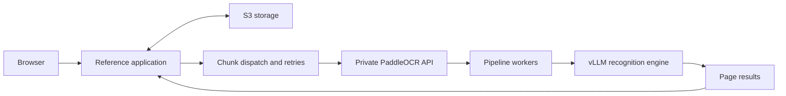

# PaddleOCR on Kubernetes

A reference application and Helm charts for running PDF extraction on your own GPU infrastructure. Upload a PDF, process it in page chunks, and browse or download the resulting Markdown, structured page data and images.

The application stores inputs, progress and results in S3. The inference service runs PaddleOCR-VL with a gateway, Triton pipeline workers and a vLLM recognition engine on one dedicated GPU per pod.



## What's included

- `backend/`: FastAPI application, S3 persistence, chunk leases, retries, document assembly and Prometheus metrics.
- `frontend/`: Svelte UI with PDF preview, extracted content, downloads and request timelines.
- `charts/paddleocr-vl-hps/`: GPU inference service, with configurable worker count, request batching and optional KEDA scaling.
- `charts/paddleocr-app/`: CPU application deployment and private Service.
- `examples/`: portable app and L40S configuration examples.
- `scripts/`: image builds and inference-chart deployment helpers.

This repository does not include test documents, benchmark outputs, AWS credentials, private registry images or production infrastructure settings. It is a reference integration, not a hosted service. The app has no built-in authentication or tenant isolation: keep it private or put it behind your authenticated application before using customer documents.

## Prerequisites

- A recent Kubernetes cluster supporting native sidecars (`initContainers` with `restartPolicy: Always`; Kubernetes 1.29+ with the feature enabled).
- Helm 3, NVIDIA drivers/container runtime and the NVIDIA device plugin on GPU nodes.
- An S3 bucket and a workload IAM role permitting the app to list its prefix and read/write/delete its objects. Use EKS Pod Identity or IRSA in AWS; do not bake credentials into images.
- A registry accessible to your nodes. Build or mirror the serving images before installing the OCR chart.
- Optional: KEDA and Prometheus for backlog-based autoscaling.

Use dedicated, single-GPU nodes. The chart gives the vLLM container the GPU resource and exposes the same GPU to the pipeline container. Its `NVIDIA_VISIBLE_DEVICES=all` sharing mode assumes a compatible NVIDIA runtime and a dedicated GPU node; it is not an isolation mechanism for unrelated workloads. Do not enable device-plugin time slicing for this default design.

## Build the application

From the repository root:

```bash
export APP_IMAGE=your-registry/paddleocr-app:0.1.0
docker buildx build --platform linux/amd64 -t "$APP_IMAGE" --push .
```

For local development:

```bash
cd frontend
npm ci
npm run build
cd ..
cp -R frontend/dist backend/app/static
python3 -m venv .venv
.venv/bin/pip install -r backend/requirements.txt
export S3_BUCKET=your-bucket
export AWS_REGION=us-east-1
export PADDLEOCR_URL=http://localhost:8118
PYTHONPATH=backend .venv/bin/python -m app
```

Use your normal AWS credential chain locally. Open `http://localhost:8080`. To reach a cluster OCR service locally, run `kubectl -n paddleocr port-forward svc/paddleocr-hps 8118:8080` in another terminal. Frontend development uses `npm run dev` and proxies `/api` to port 8080.

## Build the serving images

The build helper downloads pinned PaddleOCR gateway sources and the PaddleX HPS SDK, builds the gateway and pipeline images, and mirrors the upstream inference/base images into your ECR registry. Review the script before running it: it creates ECR repositories, and its default Kaniko mode creates temporary build resources in the chosen cluster.

```bash
export AWS_PROFILE=your-profile
export AWS_REGION=us-east-1
export ECR_REGISTRY=your-account.dkr.ecr.us-east-1.amazonaws.com
BUILDER=docker bash scripts/build-paddleocr-images.sh
```

Alternatively set `KUBE_CONTEXT` and use `BUILDER=kaniko`. The Docker path requires Docker Buildx; large GPU images need substantial local disk space. AWS CLI is required for both paths. Registry authentication comes from your AWS identity.

The base OCR chart can use the mirrored Paddle-provided inference image. `values-stock-vllm.yaml` shows how to use upstream vLLM instead. These are different serving configurations; do not assume the same throughput.

### Patched vLLM builds

`examples/l40s-values.yaml` is an opt-in six-worker profile requiring a **separately built, validated vLLM image with PaddleOCR encoder graph support**. An ordinary upstream image is not a drop-in replacement for that profile.

The included `scripts/build-vllm-image.sh` layers a model file from a supplied vLLM checkout onto the selected upstream release. Set `VLLM_SRC` explicitly; no workstation-relative checkout is assumed. Review and pin the source revision yourself. The script requires a cluster build context and publishes the result to your ECR registry:

```bash
export KUBE_CONTEXT=your-build-cluster
export VLLM_SRC=/absolute/path/to/your/patched/vllm
export REGION=us-east-1
export IMAGE_TAG=v0.29.0-paddleocr-patched
bash scripts/build-vllm-image.sh
```

Encoder graph work is tracked in [vLLM PR #44394](https://github.com/vllm-project/vllm/pull/44394). This repository does not vendor the patched vLLM checkout or distribute the private evaluation image. Building from an arbitrary PR revision does not guarantee equivalence with a previously tested build. Resolve the image digest, validate startup and extraction quality, and deploy that digest.

## Deploy the OCR service

Start from a local values file; it is intentionally ignored by Git:

```bash
cp .values.example.yaml .values.yaml
# Set your registry, instance type, and optional Porter node-group ID.
export KUBE_CONTEXT=your-cluster
bash scripts/deploy-paddleocr.sh
```

The base chart uses three pipeline workers with L4-oriented resource settings. Its registry defaults to `example.invalid` so an unconfigured installation cannot pull a private development image. For the L40S profile:

```bash
export VLLM_IMAGE_REF=your-registry/vllm:your-validated-patched-tag
helm upgrade --install paddleocr-hps charts/paddleocr-vl-hps \
  --kube-context "$KUBE_CONTEXT" -n paddleocr --create-namespace \
  -f examples/l40s-values.yaml \
  --set-string registry="$ECR_REGISTRY" \
  --set-string vlm.imageRef="$VLLM_IMAGE_REF"
```

This example requests three dedicated g6e.2xlarge nodes. Provision them through your node pool/Karpenter configuration and set any required taints, tolerations and node-group selector. For a one-GPU evaluation, add `--set replicas=1`. Native sidecars start vLLM before the pipeline, then the gateway; startup can take several minutes. Model weights may download on first startup with stock/custom vLLM images.

## Deploy the app

```bash
helm upgrade --install paddleocr-app charts/paddleocr-app \
  --kube-context "$KUBE_CONTEXT" -n paddleocr --create-namespace \
  -f examples/app-values.yaml \
  --set-string image="$APP_IMAGE" \
  --set-string env.S3_BUCKET="$S3_BUCKET"
kubectl --context "$KUBE_CONTEXT" -n paddleocr \
  port-forward svc/paddleocr-app 8080:8080
```

Configure the chart's service account with your bucket role before submitting documents. The examples create private ClusterIP services and no public ingress. The app can start before OCR is ready and waits for inference availability. `/api/readyz` reports application admission readiness, not GPU readiness.

Important environment settings:

- `S3_BUCKET`, `S3_PREFIX`, `AWS_REGION`: storage and region; `S3_ENDPOINT_URL` optionally overrides the S3 endpoint.
- `PADDLEOCR_URL`: the gateway URL, not the vLLM endpoint.
- `DEFAULT_CHUNK_PAGES=50`: default pages per HTTP request.
- `DEFAULT_CONCURRENCY`: outstanding requests per document; `JOB_CONCURRENCY`: simultaneous jobs. Consider their combined load before raising either.
- `OCR_BATCH_SIZE=8`, `OCR_BATCH_WAIT_SECONDS=5`: the app's dispatch grouping. This is separate from Triton's configured collection delay.
- `OCR_TIMEOUT_SECONDS`, `OCR_ATTEMPTS`, `OCR_READY_WAIT_SECONDS`: request timeout, retry count and readiness wait.
- `DRAIN_TIMEOUT_SECONDS`: finish admitted work during shutdown; keep the Kubernetes termination grace longer than this.

## Batching and scaling

One HTTP request contains a PDF chunk. Triton can combine several requests into one pipeline execution. Each pipeline worker handles one execution at a time; the recognition engine separately batches individual crops. More HTTP requests are not always more GPU throughput. Grouped requests complete together, so long requests can delay smaller requests in the same batch.

The app exports Prometheus text at `/api/metrics`:

- `paddleocr_pending_pages`: pages in queued and running unfinished chunks.
- `paddleocr_pending_chunks`: unfinished chunks.
- `paddleocr_active_jobs`: queued, processing or assembling jobs.
- `paddleocr_jobs_total{status="done"|"failed"}`: job counts, exposed as gauges.
- `paddleocr_draining`: whether this app replica is shutting down.

Enable `autoscaling.enabled` in the OCR chart only after Prometheus is scraping the app. Set `autoscaling.prometheusUrl`, `query`, `minReplicas`, `maxReplicas` and `pagesPerReplica`. Adapt the query to your ownership model: do not sum identical global backlog snapshots exported by multiple replicas. Validate recovery and scale-down under load; metrics, a PDB and a long termination grace alone do not guarantee interruption-free requests.

The optional profiling and runtime-patch chart settings are diagnostics, disabled by default. They are not substitutes for a reviewed inference image. Request success is not an accuracy score: inspect extracted tables, figures and output truncation on your documents.

## Validation

```bash
helm lint charts/paddleocr-vl-hps
helm lint charts/paddleocr-app
helm template paddleocr-hps charts/paddleocr-vl-hps -f examples/l40s-values.yaml >/dev/null
helm template paddleocr-app charts/paddleocr-app -f examples/app-values.yaml >/dev/null
python3 -m compileall -q backend/app
(cd frontend && npm ci && npm run build)
```

CI performs these static/build checks. GPU inference, S3 permissions and end-to-end accuracy require your configured environment; they are not claimed by a passing frontend build.

## Licensing and upstream projects

Repository code is Apache-2.0 licensed; see `LICENSE` and `NOTICE`. Dependencies, downloaded images, model weights and upstream SDKs retain their own licenses and terms. Builds fetch external artifacts; review and pin them according to your release policy.

- [PaddleOCR](https://github.com/PaddlePaddle/PaddleOCR)
- [PaddleX](https://github.com/PaddlePaddle/PaddleX)
- [vLLM](https://github.com/vllm-project/vllm)
