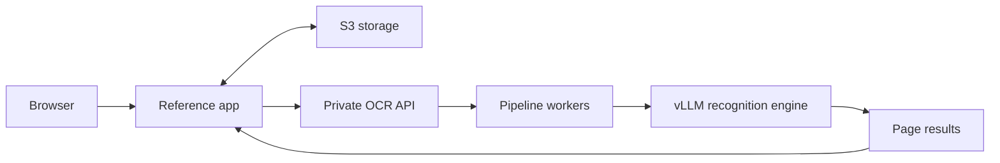

# PaddleOCR on Kubernetes

A reference PDF extraction app and Helm chart for running PaddleOCR-VL on your own GPU infrastructure.

Upload a PDF, process it in page chunks, and browse or download the extracted Markdown, page data and images. Inputs, progress and results are stored in S3. The UI includes a PDF viewer and request timing breakdowns.

## Architecture

The app handles chunking, retries and document assembly on CPU. The OCR service runs the gateway, pipeline workers and recognition engine together, with one dedicated GPU per pod.

## Application

Deploy with [`porter.yaml`](porter.yaml). Set your S3 bucket, region and OCR endpoint, and connect an AWS role with bucket access. The manifest includes health checks and metrics scraping; it does not contain account-specific credentials or domains.

- `backend/`: FastAPI API, S3 persistence and document processing.
- `frontend/`: Svelte UI.
- `Dockerfile`: builds the app and UI into one image.

The default is 50 pages per request. Request concurrency and simultaneous jobs are configurable in `porter.yaml`. The app has no built-in authentication or tenant isolation; use it privately or behind your application's authentication.

## OCR service

[`charts/paddleocr-vl-hps`](charts/paddleocr-vl-hps) deploys the GPU service. Configure your image registry, GPU node placement and worker count in Helm values. The chart requires native-sidecar support and NVIDIA GPU support in the cluster.

[`examples/l40s-values.yaml`](examples/l40s-values.yaml) provides the six-worker L40S profile with request batching and optional autoscaling. It requires a validated patched vLLM image; image references are placeholders. Patched images and model artifacts are managed separately. Build helpers remain in `scripts/` for maintainers.

## Autoscaling integration

The app exposes `/api/metrics` with unfinished page/request counts, active jobs, completed/failed jobs and shutdown state. The chart's optional KEDA integration scales the OCR service using this backlog. Connect Prometheus and ensure shared work is counted once across app replicas.

## Validation and licensing

CI checks the frontend build, Python syntax and Helm rendering. GPU inference and extraction quality must be validated in the target environment.

Apache-2.0; see [LICENSE](LICENSE) and [NOTICE](NOTICE). PaddleOCR, PaddleX, vLLM and model artifacts retain their respective licenses.
